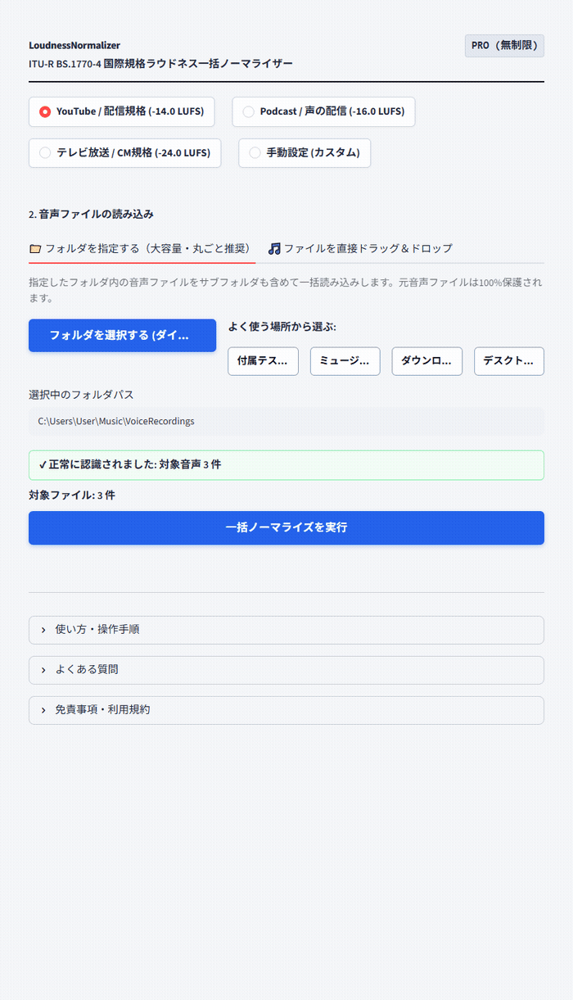

# 【Windows専用】LoudnessNormalizer GUI ｜ 動画・音声 YouTube規格一括ラウドネス最適化ツール

> **「書き出し後の『音、小さくないですか？』はもう二度と言わせない。」**  
> ドラッグ＆ドロップ3秒。動画・音声ファイルを枠内に放り込むだけで、YouTube推奨の国際標準規格（-14.0 LUFS）へ全自動で一括統一するWindows専用ポータブルGUIツールです。

## ■ 操作デモ（実際の動作）

---

## ■ こんな「書き出し後の二度手間」、毎月何時間ドブに捨てていませんか？

- **クライアントや視聴者からの「他の動画より音が小さい」「急に大きくなって耳が痛い」という指摘**
- **音量を上げようとしたら、大事な声やBGMがバリッと割れて台無しになる恐怖**
- **毎回DAWや編集ソフトを立ち上げ、ラウドネスメーターとにらめっこしながら手動調整する10分〜15分のタイムロス**
- **動画を20本納品するなら、毎月5時間以上が「音量の微調整」だけに消えている現実**

動画編集や音声配信において、音量（ラウドネス）の均一化はプロとして避けて通れない品質基準です。  
しかし、**本来クリエイティブであるはずの貴重な時間を、単純な音量測定と修正作業に奪われ続ける必要はありません。**

「LoudnessNormalizer GUI」は、そんな現場の疲弊をゼロにするために開発された、完全実務特化型のポータブルソフトウェアです。

---

## ■ なぜ、他の方法ではなく「LoudnessNormalizer」なのか？（4つの圧倒的理由）

### 1. 「体感音量（-14.0 LUFS）」へ全自動で一発ジャストフィット
一般的な編集ソフトの「ノーマライズ（最大ピークを0dBに合わせる処理）」では、声の抑揚や曲調によって人間の耳が感じる音量（体感音量）がバラバラになってしまいます。  
本ツールは、放送・配信の国際標準規格（ITU-R BS.1770-4）に準拠。人間の聴覚特性に基づいた「真のラウドネス値」を正確に測定し、YouTubeのアルゴリズムに最も最適化された **-14.0 LUFS** へ瞬時に揃えます。

### 2. 音割れを物理的に防ぐ「True Peak 安全リミッター」常時稼働
無理に音量を引き上げた結果、再生機器や配信プラットフォームでのD/A変換時に「インターサンプルピーク（音割れ歪み）」が発生してはプロ失格です。  
本ツールは波形の瞬間最大ピーク（True Peak）を厳密に監視。音割れの危険（-1.0 dBTP超過）を検知すると安全リミッターが自動で介入し、**原音のクリアな解像度を100%保ったまま限界まで音量を最大化**します。

### 3. 未公開案件・社外秘素材も安心の「完全オフライン動作」
無料のWeb変換サービスのように、大切なクライアントの動画や未公開の音源データを外部サーバーにアップロードする必要は一切ありません。  
すべての処理があなたのPC内部だけで完結するため、情報漏洩リスクはゼロ。企業案件や機密インタビューも安心して処理できます。

### 4. 面倒な環境構築ゼロ。解凍してダブルクリックですぐ起動
Pythonのインストールや面倒なコマンド入力、黒い画面（コマンドプロンプト）は一切不要です。  
配布ZIPを解凍し、専用ランチャーをダブルクリックするだけで直感的な操作画面がスッと立ち上がります。USBメモリに入れて持ち運ぶことも可能です。

---

## ■ 作業時間は「1本15分」から「3秒」へ（使い方3ステップ）

1. **起動する**: フォルダ内の `LoudnessNormalizer.vbs` をダブルクリックします。
2. **放り込む**: 音量を揃えたいファイル（WAV, MP3, FLAC, M4A, OGG）をまとめてドラッグ＆ドロップします。
3. **ボタンを押す**: **「一括ノーマライズを実行」** をクリック。
   - 処理前後の数値（LUFS / Peak / 適用ゲイン）が一覧表でクリアに表示されます。
   - **「📦 調整済み音源をまとめて一括保存 (ZIP)」** を押せば、高音質WAVとExcelで開ける測定レポートCSVが一瞬で手に入ります。

---

## ■ 動作環境・仕様

- **対応OS**: Windows 10 / 11 (64-bit)
- **インストール**: 不要（完全スタンドアロン動作・Embedded Python同梱）
- **対応入力フォーマット**: WAV, MP3, FLAC, OGG, M4A
- **出力フォーマット**: 24-bit WAV / 16-bit WAV / 32-bit Float WAV
- **プリセット**: YouTube・動画配信（-14 LUFS）、ポッドキャスト（-16 LUFS）、放送規格（-24 LUFS）、カスタム数値指定

---

## 🛒 ダウンロード・ご購入のご案内（BOOTH公式ストア）

まずは使い勝手をお手元のPCでお試しいただけるよう、無料Lite版と全機能対応の製品版をご用意しております。

👉 **[BOOTHでダウンロード・購入する](https://nichesoftmakers.booth.pm/items/8808346)**  
- **無料Lite版**: 0円（まずは基本機能や快適な操作感をお試しいただけます）
- **製品版**: **2,980円**（追加課金なしの買い切り・全機能無制限）

動画編集・音声処理・事務自動化など、全ツールの製品版やおトクな業務別バンドルパックも公式BOOTHストアにて公開中です。

---

## 💡 【ご購入・ご利用前に必ずご確認ください】初回起動時のWindows保護画面について

本ソフトは、パソコンのレジストリを変更せず解凍するだけで手軽に使える「ポータブル仕様（インストール不要）」として提供されているため、初回起動時にWindowsの画面に「**WindowsによってPCが保護されました**」という青い確認画面（SmartScreen）が表示される場合があります。

これは、パソコンのレジストリを変更せず手軽に使える未署名のツールに対して、**Windowsが形式上必ず表示する標準的な安全確認画面**です。  
ウイルス等の不正プログラムは一切含まれておらず、インターネット通信も行わない「完全ローカル・安全設計」となっております。

**【解除・起動手順（2クリックで完了します）】**
1. 画面内の **「詳細情報」** をクリックします。
2. 右下に現れる **「実行」** ボタンをクリックします。  
※一度実行すれば、次回以降はこの画面は表示されずスムーズに起動します。

---

## 📄 免責事項・利用規約（ライセンス区分）

- **個人利用を想定**: 本ソフトウェアは個人クリエイター・個人事業主等のPC業務効率化を目的として開発された個人利用専用ツールです。
- **シングルユーザー許諾**: ご購入者様本人（1名）のみ利用可能（ご自身が専属で使用する複数台PCでの利用は許可されます）。組織内での共有・複数名での共同利用・社内共有には対応しておりません。
- 本ソフトウェアは現状有姿（As-Is）で提供され、技術サポート・個別動作保証は行われません。詳細は同梱の `README_免責事項.txt`（または `README.txt`）をご確認ください。

---

## 📮 不具合報告・改善要望目安箱

本ツールに関する不具合の報告や「こんな機能が欲しい」というご要望は、以下の専用目安箱フォームよりお気軽にお寄せください（完全匿名・返信なし）：  
👉 **[ご意見・不具合報告フォーム ](https://forms.gle/2ib5A8EuhpaRs8QSA)**  
※原則として個別サポート・返信は行っておりませんが、いただいた内容はすべて開発者が目を通し、今後の機能改善やアップデートの参考とさせていただきます。
